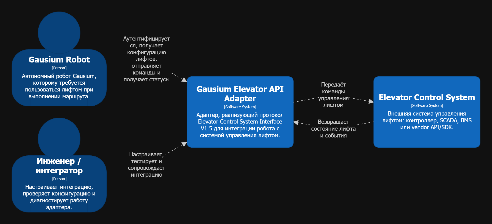
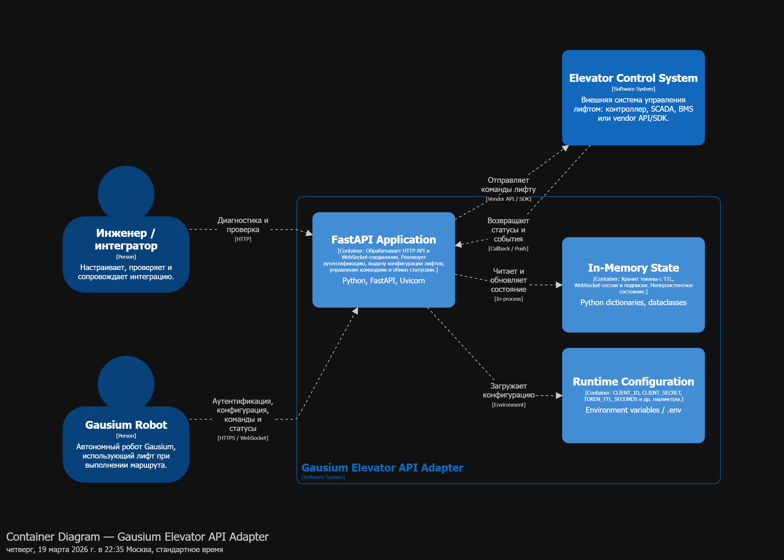
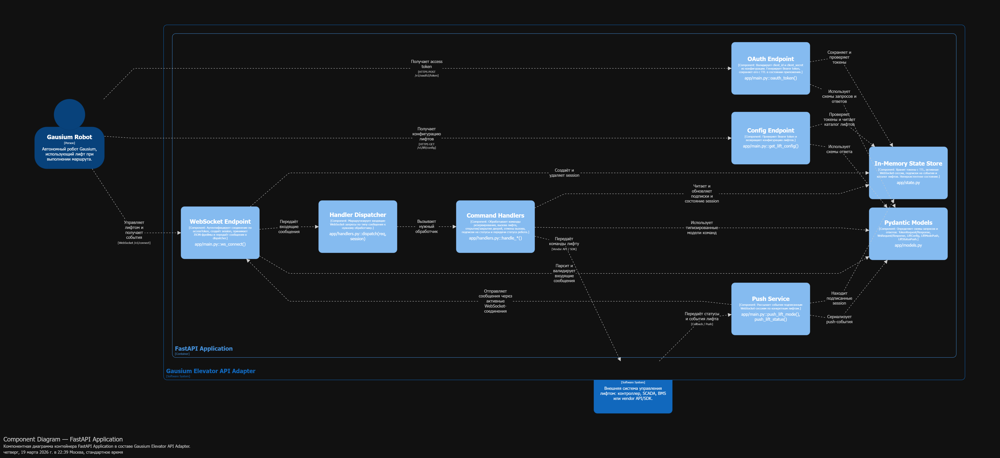
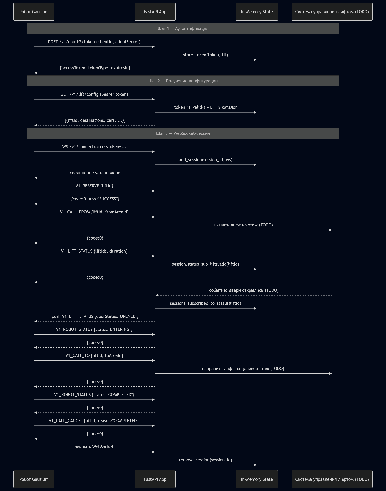
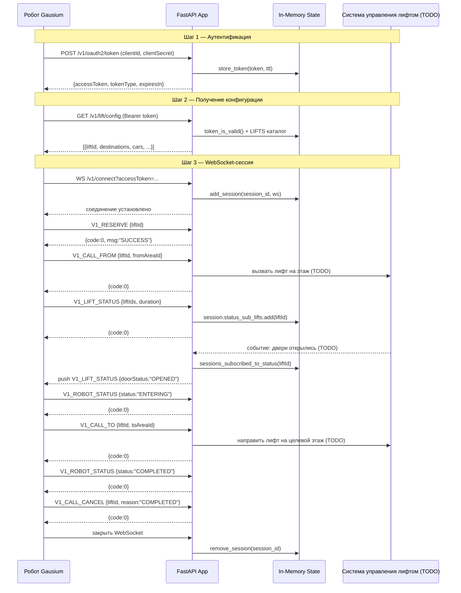

# Gausium Elevator API Adapter

Адаптер для интеграции роботов **Gausium** с системой управления лифтом. Реализует протокол **Elevator Control System Interface V1.5** — стандартизированный API, через который робот аутентифицируется, получает конфигурацию лифтов и управляет ими в реальном времени через WebSocket.

---

## Содержание

- [Как это работает](#как-это-работает)
- [Структура проекта](#структура-проекта)
- [Требования](#требования)
- [Установка и запуск](#установка-и-запуск)
- [Конфигурация](#конфигурация)
- [API](#api)
- [Тестирование](#тестирование)
- [Архитектура (C4)](#архитектура-c4)
- [Статус интеграции](#статус-интеграции)

---

## Как это работает

```
Робот Gausium  ──►  [POST /v1/oauth2/token]     Получает Bearer token
               ──►  [GET  /v1/lift/config]       Узнаёт конфигурацию лифтов
               ──►  [WS   /v1/connect]           Управляет лифтом в реальном времени
```

Полный сценарий взаимодействия:

1. Робот получает OAuth-токен по `client_id` / `client_secret`
2. Запрашивает конфигурацию лифтов (этажи, кабины, двери)
3. Открывает WebSocket-соединение
4. Резервирует лифт → вызывает на нужный этаж → садится → едет → выходит → отменяет резервацию
5. Подписывается на события (изменение статуса дверей, режима лифта) и получает push-уведомления

---

## Структура проекта

```
.
├── main.py                  # Точка входа — запуск uvicorn
├── app/
│   ├── main.py              # FastAPI-приложение, эндпоинты, push-функции
│   ├── handlers.py          # Обработчики WebSocket-команд
│   ├── models.py            # Pydantic-схемы запросов и ответов
│   └── state.py             # In-memory состояние (токены, сессии, каталог лифтов)
├── docs/
│   ├── images/              # Изображения C4-диаграмм
│   └── *.md                 # Документация по протоколу
├── test_client.py           # Тест-клиент, имитирующий поведение робота
├── .env.example             # Пример файла конфигурации
└── requirements.txt
```

---

## Требования

- Python 3.10+
- pip

---

## Установка и запуск

```bash
# 1. Клонировать репозиторий
git clone <repo-url>
cd gausium_elevator_api_adapter

# 2. Создать виртуальное окружение
python -m venv .venv
source .venv/bin/activate      # Windows: .venv\Scripts\activate

# 3. Установить зависимости
pip install -r requirements.txt

# 4. Создать файл конфигурации
cp .env.example .env
# Отредактировать .env — задать CLIENT_ID и CLIENT_SECRET

# 5. Запустить сервер
python main.py
```

Сервер запустится на `http://0.0.0.0:8000`.
Интерактивная документация API доступна по адресу `http://localhost:8000/docs`.

---

## Конфигурация

Все параметры задаются в файле `.env`:

| Переменная         | Описание                                                   | Пример             |
|--------------------|------------------------------------------------------------|--------------------|
| `CLIENT_ID`        | Идентификатор клиента, который робот передаёт при OAuth    | `my_client_id`     |
| `CLIENT_SECRET`    | Секрет клиента для OAuth                                   | `my_secret`        |
| `TOKEN_TTL_SECONDS`| Время жизни выданного токена в секундах                    | `3600`             |

---

## API

### `POST /v1/oauth2/token`

Выдаёт Bearer-токен по OAuth 2.0 client credentials.

**Тело запроса** (`application/x-www-form-urlencoded` или JSON):
```
grantType=client_credentials&clientId=…&clientSecret=…
```

**Ответ:**
```json
{
  "accessToken": "…",
  "tokenType": "Bearer",
  "expiresIn": 3600
}
```

---

### `GET /v1/lift/config`

Возвращает конфигурацию лифтов: этажи, кабины, двери.

**Заголовок:** `Authorization: Bearer <token>`

**Query-параметры:**

| Параметр    | Тип    | Описание                                           |
|-------------|--------|----------------------------------------------------|
| `requestId` | string | Идентификатор запроса                              |
| `timestamp` | int    | Время запроса в миллисекундах                      |
| `liftIds`   | string | JSON-массив ID лифтов. Если не указан — все лифты  |

**Ответ:**
```json
{
  "code": 0,
  "msg": "SUCCESS",
  "data": [
    {
      "liftId": "…",
      "displayName": "Elevator 1",
      "destinations": [
        { "areaId": "1000", "floorId": "1", "displayName": "Floor 1", "doorId": "1" }
      ],
      "cars": [
        { "carId": "1001010", "doors": ["1", "2"] }
      ]
    }
  ]
}
```

---

### `WS /v1/connect?accessToken=<token>`

Двунаправленный WebSocket-канал для управления лифтом.

**Формат сообщения (Robot → Server):**
```json
{
  "sessionId": "…",
  "requestId": "…",
  "timestamp": 1712345678000,
  "type": "V1_RESERVE",
  "liftId": "…"
}
```

**Формат ответа (Server → Robot):**
```json
{
  "code": 0,
  "msg": "SUCCESS",
  "data": { "sessionId": "…", "requestId": "…", "timestamp": … }
}
```

#### Типы команд

| Тип команды        | Направление      | Описание                                           |
|--------------------|------------------|----------------------------------------------------|
| `V1_RESERVE`       | Robot → Server   | Зарезервировать лифт                               |
| `V1_CALL_FROM`     | Robot → Server   | Вызвать лифт на этаж отправления                   |
| `V1_CALL_TO`       | Robot → Server   | Направить лифт на целевой этаж                     |
| `V1_OPEN_DOOR`     | Robot → Server   | Держать двери открытыми N секунд                   |
| `V1_CLOSE_DOOR`    | Robot → Server   | Закрыть двери через N секунд                       |
| `V1_CALL_CANCEL`   | Robot → Server   | Отменить резервацию (`reason: COMPLETED/TERMINATED`) |
| `V1_LIFT_MODE`     | Robot → Server   | Подписаться на изменения режима (доступность)      |
| `V1_LIFT_STATUS`   | Robot → Server   | Подписаться на изменения статуса (двери, движение) |
| `V1_ROBOT_STATUS`  | Robot → Server   | Передать статус робота (`WAITING/ENTERING/TAKING/EXITING/COMPLETED/FAILED`) |
| `V1_LIFT_MODE`     | Server → Robot   | Push: изменилась доступность лифта                 |
| `V1_LIFT_STATUS`   | Server → Robot   | Push: изменился статус дверей или движения         |

#### Коды ошибок

| Код     | Значение                                  |
|---------|-------------------------------------------|
| `0`     | Успех                                     |
| `29001` | Лифт не найден или недоступен             |
| `29008` | Все кабины лифта заняты                   |
| `29009` | Лифт не был зарезервирован                |
| `40000` | Неизвестный тип сообщения                 |
| `40001` | Ошибка валидации запроса                  |

---

## Тестирование

Запустить встроенный тест-клиент, который имитирует полный сценарий работы робота:

```bash
python test_client.py
```

Клиент последовательно проверяет:
- OAuth: неверные и верные учётные данные
- Config: без токена, все лифты, конкретный лифт, несуществующий лифт
- WebSocket: полный цикл от резервации до отмены, все команды, серверные push-события

---

## Архитектура (C4)

### Уровень 1 — Контекст системы

> Кто использует систему и с какими внешними системами она взаимодействует.



<details>
<summary>Показать DSL</summary>

```dsl
workspace "Gausium Elevator API Adapter" "C4 Level 1 — System Context" {

    model {
        robot = person "Gausium Robot" "Автономный робот Gausium, которому требуется пользоваться лифтом при выполнении маршрута."

        adapter = softwareSystem "Gausium Elevator API Adapter" "Адаптер, реализующий протокол Elevator Control System Interface V1.5 для интеграции робота с системой управления лифтом."

        elevatorControl = softwareSystem "Elevator Control System" "Внешняя система управления лифтом: контроллер, SCADA, BMS или vendor API/SDK."
        operator = person "Инженер / интегратор" "Настраивает интеграцию, проверяет конфигурацию и диагностирует работу адаптера."

        robot -> adapter "Аутентифицируется, получает конфигурацию лифтов, отправляет команды и получает статусы"
        adapter -> elevatorControl "Передаёт команды управления лифтом"
        elevatorControl -> adapter "Возвращает состояние лифта и события"
        operator -> adapter "Настраивает, тестирует и сопровождает интеграцию"
    }

    views {
        systemContext adapter "context" {
            include *
            autoLayout lr

            title "System Context — Gausium Elevator API Adapter"
            description "Контекстная диаграмма системы интеграции робота Gausium с лифтом."
        }

        theme default
    }
}
```

</details>

---

### Уровень 2 — Контейнеры

> Из каких исполняемых блоков состоит система.



<details>
<summary>Показать DSL</summary>

```dsl
workspace "Gausium Elevator API Adapter" "C4 Level 2 — Container Diagram" {

    model {
        robot = person "Gausium Robot" "Автономный робот Gausium, использующий лифт при выполнении маршрута."
        operator = person "Инженер / интегратор" "Настраивает, проверяет и сопровождает интеграцию."
        elevatorControl = softwareSystem "Elevator Control System" "Внешняя система управления лифтом: контроллер, SCADA, BMS или vendor API/SDK."

        adapter = softwareSystem "Gausium Elevator API Adapter" "Система интеграции между роботом Gausium и системой управления лифтом." {

            api = container "FastAPI Application" "Python, FastAPI, Uvicorn" "Обрабатывает HTTP API и WebSocket-соединения. Реализует аутентификацию, выдачу конфигурации лифтов, управление командами и обмен статусами."

            state = container "In-Memory State" "Python dictionaries, dataclasses" "Хранит токены с TTL, WebSocket-сессии и подписки. Неперсистентное состояние."

            config = container "Runtime Configuration" "Environment variables / .env" "CLIENT_ID, CLIENT_SECRET, TOKEN_TTL_SECONDS и др. параметры."

        }

        robot -> api "Аутентификация, конфигурация, команды и статусы" "HTTPS / WebSocket"
        operator -> api "Диагностика и проверка" "HTTP"

        api -> state "Читает и обновляет состояние" "In-process"
        api -> config "Загружает конфигурацию" "Environment"

        api -> elevatorControl "Отправляет команды лифту" "Vendor API / SDK"
        elevatorControl -> api "Возвращает статусы и события" "Callback / Push"
    }

    views {
        container adapter {
            include *
            autoLayout lr
            title "Container Diagram — Gausium Elevator API Adapter"
        }

        theme default
    }
}
```

</details>

---

### Уровень 3 — Компоненты (FastAPI Application)

> Из каких модулей и компонентов состоит основной контейнер.



<details>
<summary>Показать DSL</summary>

```dsl
workspace "Gausium Elevator API Adapter" "C4 Level 3 — Component Diagram" {

    model {
        robot = person "Gausium Robot" "Автономный робот Gausium, использующий лифт при выполнении маршрута."
        elevatorControl = softwareSystem "Elevator Control System" "Внешняя система управления лифтом: контроллер, SCADA, BMS или vendor API/SDK."

        adapter = softwareSystem "Gausium Elevator API Adapter" "Система интеграции между роботом Gausium и системой управления лифтом." {

            api = container "FastAPI Application" "Python, FastAPI, Uvicorn" "Обрабатывает HTTP API и WebSocket-соединения. Реализует аутентификацию, выдачу конфигурации лифтов, управление командами и обмен статусами." {

                oauthEp = component "OAuth Endpoint" "app/main.py::oauth_token()" "Валидирует client_id и client_secret из конфигурации. Генерирует Bearer token, сохраняет его с TTL в состоянии приложения."

                configEp = component "Config Endpoint" "app/main.py::get_lift_config()" "Проверяет Bearer token и возвращает конфигурацию лифтов."

                wsEp = component "WebSocket Endpoint" "app/main.py::ws_connect()" "Аутентифицирует соединение по accessToken, создаёт session, принимает JSON-фреймы и передаёт сообщения в dispatcher."

                pushService = component "Push Service" "app/main.py::push_lift_mode(), push_lift_status()" "Рассылает события подписанным WebSocket-сессиям по конкретным лифтам."

                dispatcher = component "Handler Dispatcher" "app/handlers.py::dispatch(req, session)" "Маршрутизирует входящие WebSocket-запросы по типу сообщения к нужному обработчику."

                handlers = component "Command Handlers" "app/handlers.py::handle_*()" "Обрабатывает команды резервирования, вызова лифта, открытия/закрытия дверей, отмены вызова, подписки на статусы и передачи статуса робота."

                stateStore = component "In-Memory State Store" "app/state.py" "Хранит токены с TTL, активные WebSocket-сессии, подписки на события и каталог лифтов. Неперсистентное состояние."

                models = component "Pydantic Models" "app/models.py" "Определяет схемы запросов и ответов: TokenRequest/Response, WsRequest/Response, LiftConfig, LiftModePush, LiftStatusPush."
            }
        }

        robot -> oauthEp "Получает access token" "HTTPS POST /v1/oauth2/token"
        robot -> configEp "Получает конфигурацию лифтов" "HTTPS GET /v1/lift/config"
        robot -> wsEp "Управляет лифтом и получает события" "WebSocket /v1/connect"

        oauthEp -> stateStore "Сохраняет и проверяет токены"
        configEp -> stateStore "Проверяет токены и читает каталог лифтов"
        wsEp -> stateStore "Создаёт и удаляет session"
        wsEp -> dispatcher "Передаёт входящие сообщения"
        dispatcher -> handlers "Вызывает нужный обработчик"
        handlers -> stateStore "Читает и обновляет подписки и состояние session"
        pushService -> stateStore "Находит подписанные session"
        pushService -> wsEp "Отправляет сообщения через активные WebSocket-соединения"

        oauthEp -> models "Использует схемы запросов и ответов"
        configEp -> models "Использует схемы ответа"
        wsEp -> models "Парсит и валидирует входящие сообщения"
        pushService -> models "Сериализует push-события"
        handlers -> models "Использует типизированные модели команд"

        handlers -> elevatorControl "Передаёт команды лифту" "Vendor API / SDK"
        elevatorControl -> pushService "Передаёт статусы и события лифта" "Callback / Push"
    }

    views {
        component api {
            include *
            autoLayout lr
            title "Component Diagram — FastAPI Application"
            description "Компонентная диаграмма контейнера FastAPI Application в составе Gausium Elevator API Adapter."
        }

        theme default
    }
}
```

</details>

---

### Диаграмма последовательности — полный сценарий работы робота



<details>
<summary>Показать DSL</summary>



</details>

---

## Статус интеграции

Адаптер реализует полный каркас протокола. Для подключения к реальной системе управления лифтом необходимо заполнить следующие точки интеграции:

| Файл | Функция | Что нужно сделать |
|------|---------|-------------------|
| `app/handlers.py` | `handle_reserve()` | Проверить доступность лифта в реальной системе |
| `app/handlers.py` | `handle_call_from()` | Отправить команду вызова лифта на этаж |
| `app/handlers.py` | `handle_call_to()` | Отправить команду направления на целевой этаж |
| `app/handlers.py` | `handle_open_door()` | Отправить команду удержания дверей |
| `app/handlers.py` | `handle_close_door()` | Отправить команду закрытия дверей |
| `app/handlers.py` | `handle_cancel()` | Освободить резервацию в реальной системе |
| `app/state.py` | `LIFTS` | Заменить stub-каталог реальными данными из БД/API |
| `app/main.py` | `push_lift_status()` | Вызывать при получении событий от системы лифта |
| `app/main.py` | `push_lift_mode()` | Вызывать при изменении доступности лифта |
